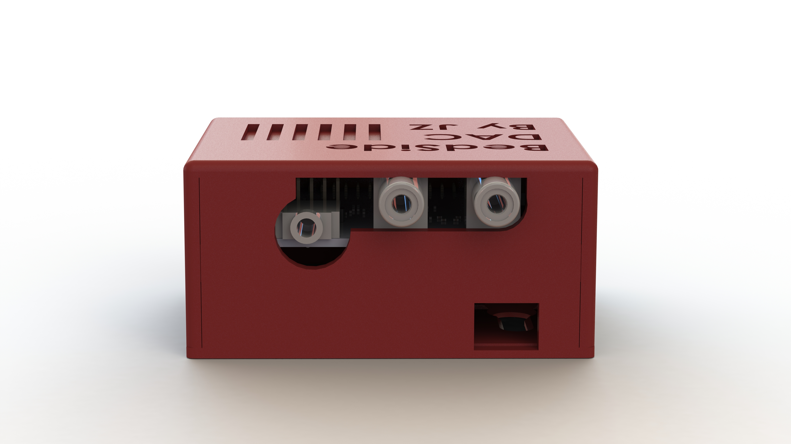

# RPI-AirPlay-HiFi

AirPlay + DAC + AMP, using a Raspberry Pi Zero W and HiFiBerry

## Renderings
Top view           |  Back view
:-------------------------:|:-------------------------:
 | 
Exploded View


## BOM

- 3D printed case, `top.STL` and `bottom.STL`
- Raspberry Pi Zero W
- A compatible DAC+AMP stack for Rpi. Here are some models compatible with this case:
  - [HIFIBERRY DAC2 PRO](https://www.hifiberry.com/shop/boards/hifiberry-dac2-pro/)
  - [HIFIBERRY DAC+ ADC PRO](https://www.hifiberry.com/shop/boards/hifiberry-dac-adc-pro/)
  - [InnoMaker Raspberry Pi HiFi DAC HAT](https://www.amazon.com/gp/product/B07D13QWV9/ref=ppx_yo_dt_b_search_asin_title?ie=UTF8&psc=1), cheapest, comes with a built-in amp, the one that I use
  
Note that all the listed audio cards are primary designed as DAC only. 
You may need to add an amplifier if your have a high impedance headphone and modify the CAD models to fit it in.
My headphone's impedance is only 55 Ohms so I'm driving it directly.

## Prepare your Raspberry Pi Zero W

1. Install Raspbian Buster Lite. Note that (1) we don't need a desktop environment and we want to max out Pi Zero's performance, so I use the Lite version, (2) ***`Buster` is the legacy version***, and using the latest `Bullseye` version may suffer from some compatibility issue. If you use [Raspberry Pi Imager](https://www.raspberrypi.com/software/), see the following screenshot to find the legacy Raspbian Buster Lite. 
2. Before removing the sd card from your computer, do the following step:
   1. Enable ssh server at startup. Create an empty file called `ssh` (no extension) at the root directory of `boot:`.
   2. Setup WiFi connection. Create a text file named `wpa_supplicant.conf` at the same directiory, paste in the following content: 

        ```
        country=US
        ctrl_interface=DIR=/var/run/wpa_supplicant GROUP=netdev
        update_config=1

        network={
            scan_ssid=1
            ssid="your_wifi_ssid"
            psk="your_wifi_password"
        }
        ```
    3. Depending on your sound card that you choose, you may need to modify the `config.txt` file to make sure audio is enabled. For the `InnoMaker DAC HAT`, Add line 
        ```
        dtoverlay=allo-boss-dac-pcm512x-audio
        ``` 
        under 
        ```
        # Enable audio (loads snd_bcm2835)
        dtparam=audio=on
        ```
        Use `dtoverlay=hifiberry-dacplus` for HiFiBerry DAC2 Pro, `dtoverlay=hifiberry-dacplusadcpro` for HiFiBerry DAC + ADC Pro. You can find them on HiFiBerry's product data sheet page (e.g. [this one](https://www.hifiberry.com/docs/data-sheets/datasheet-dac-adc-pro/))
    
    4. Plug in the sd card, boot up, wait for a while, then your Pi should be able to connect to your wifi directly. Go to your router setup page to find its IP, or you can try directly from your computer with `ssh pi@raspberrypi`. 
    5. SSH to your Pi Zero, follow [this instruction](https://github.com/mikebrady/shairport-sync/blob/master/INSTALL.md) to install ShairPort-sync. 
    6. Reboot. You should be able to find the AirPlay device from your Apple devices.